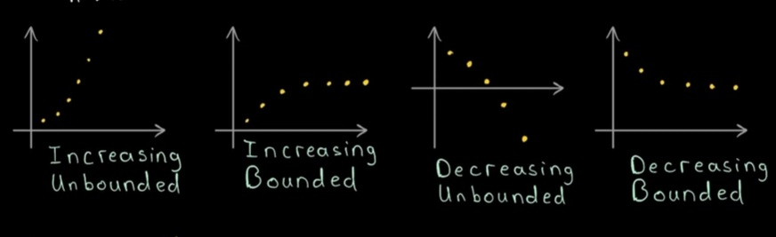
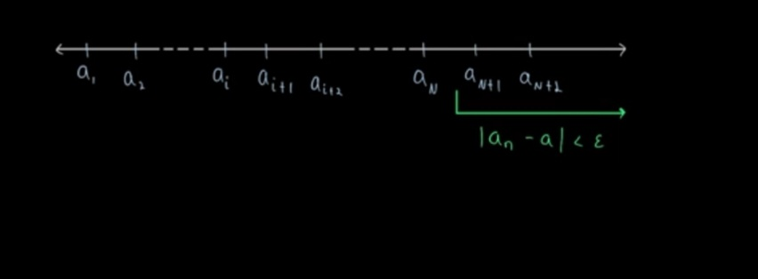

# Real Analysis : Lesson 4
----------------------------------------------------
- [find previous chapters here](lession123.md)
### so far we talked about sequences, convergence of sequences, their definitions, corresponding proofs like limit theorems, order limit theorems,. I also told to explore and prove Cauchy's first theorem and Cauchy's second theorem (form 1 and 2) on limits and Cesaro's theorem. Then we explored Cauchy sequences, bounded sequences, how convergence notion relates Cauchy sequences, convergent sequences and bounded sequences. We then studied about maximal and minimal elements eventually leading us to supremum (Least Upper Bound) and infimum (Greatest Lower Bound). We left of with a property. Completeness property of R. We will first expand a little on that and then dive into main real analysis.

## Here is more about real, completeness and how it's useful in real analysis. You may read it now or skip it for now. If you followed till day 3 on X then it shouldn't be a problem to follow along.

- [Completeness Axiom and reals](extras/real_analysis/completeness.md)

## Agenda : Today we will build on what we did previously and introduce the notion of subsequence and an important theorem along with proofs.

#### **Before we start i want to state proof of an inequality that we will use in a problem.**

### **Bernoulli's inequality : For k $\in$ $\mathbb N$ and x $\geq$ -1 : (1+x)^k >= 1+kx**

 - **Proof by induction :** 
    - **Base Case : k=1, then 1+x>=1+x**
    - **Induction Hypothesis :** Assume that (1+x)^k >= 1+kx for all k from 1 to k.
    - **Induction Step :** We need to show that (1+x)^(k+1) >= 1+(k+1)(x) = rhs
    - Notice (1+x)^(k+1)=(1+x)^k * (1+x)
    - => (1+x)^k * (1+x) >= (1+kx)(1+x) = (1+kx)+(x+k $x^2$) >= (1+kx)+x = rhs (since k $x^2$>=0)
    - Hence proved.
    - $\blacksquare$

### Problem : The sequence ($a_n$) given by an=(1+1/n)^n is convergent (prove)
- We will Bernoulli's inequality for this problem. If you don't know tests for convergence of sequences and series then i might cover them later in this series or you can check out [Dr Trefor Bazette](https://www.youtube.com/watch?v=we9xfbR8SwQ) on youtube who has a playlist on these tests. You will learn about many tests like ratio test:

Consider a series $\sum a_n$. To apply the Ratio Test, compute the limit:
$$
L = \lim_{n \to \infty} \left| \frac{a_{n+1}}{a_n} \right|
$$

- If $L < 1$, the series $\sum a_n$ converges absolutely.
- If $L > 1$ or $L -> \infty$, the series $\sum a_n$ diverges.
- If $L = 1$, the test is inconclusive.

**As an exercise you can try applying ratio test on this problem and see what happens. We will introduce a very important theorem with this problem followed by a proof.**

- **Solution :** 

### We will first check if the sequence is increasing or decreasing i.e, if $a_n$ >= $a_{n+1}$ or <=...
This will help us comment on monotoonicity of the sequence. After which if we find a lower or upper bound we can comment if the sequence is convergent or divergent.
This a because of **Monotone Convergence Theorem**
- **Monotone Convergence Theorem :** If a sequence is monotone and bounded, then it is convergent. Which means if a sequence is monotonically increasing and bounded from above atleast then it's convergent eventually. (vice versa)

### (i) **Now Take**

$$
a_n = \left(1 + \frac{1}{n}\right)^n
$$

$$
\frac{a_{n+1}}{a_n} = \frac{\left(1 + \frac{1}{n+1}\right)^{n+1}}{\left(1 + \frac{1}{n}\right)^n}
$$

$$
\frac{a_{n+1}}{a_n} = \frac{\left(1 + \frac{1}{n+1}\right)^{n+1}}{\left(1 + \frac{1}{n}\right)^n}
$$

### Multiply the numerator and denominator by
$$
\left(1 + \frac{1}{n}\right)
$$
$$
\frac{a_{n+1}}{a_n} = \frac{\left(1 + \frac{1}{n+1}\right)^{n+1} \cdot \left(1 + \frac{1}{n}\right)}{\left(1 + \frac{1}{n}\right)^n \cdot \left(1 + \frac{1}{n}\right)}
$$

### Combine the terms with $(n+1)$ powers:
$$
\frac{a_{n+1}}{a_n} = \frac{\left(1 + \frac{1}{n+1}\right)^{n+1} \cdot \left(1 + \frac{1}{n}\right)}{\left(1 + \frac{1}{n}\right)^{n+1}}
$$

### Multiply the numerator and denominator by $n \cdot (n+1)$:
$$
\frac{a_{n+1}}{a_n} = \frac{\left(1 + n \cdot (n+1) \frac{1}{n+1}\right)^{n+1} \cdot \left(1 + \frac{1}{n}\right)}{\left(1 + n \cdot (n+1) \frac{1}{n}\right)^{n+1} }
$$

### Soon we get:
$$
\left(1 + \frac{1}{n}\right) \cdot \left(1 - \frac{1}{n^2+2n+1}\right)^{n+1}
$$

$$
\left(1 + \frac{1}{n}\right) \cdot \left(1 - \frac{1}{(n+1)^2}\right)^{n+1}
$$

### We can get a lower bound using Bernoulli inequality:
$$
\left(1 + \frac{1}{n}\right) \cdot \left(1 - \frac{1}{(n+1)^2}\right)^{n+1} \geq \left(\frac{n+1}{n}\right) \cdot \left(1 - \frac{1}{(n+1)}\right) = 1
$$
So,
$$
\frac{a_{n+1}}{a_n} \geq 1 
$$
### which means ($a_n$) is monotonically increasing.

### **(ii) We can show from binomial theorem that the sequence is bounded**

**from (i) & (ii) sequence is convergent**

**Fun fact: This sequence converges to e. You might recognize this from Taylor's approximation. If you take the series of this sequence it will converge to e. You might also recognize 1^$\infty$ in the limit form which converges to e. Nonetheless, we did not have to compute the limit explicitly and we could comment on convergence or divergence of this sequence.**

## Monotone Convergence Theorem

- statement : Let ($a_n$) be a monotonic sequence then ($a_n$) is convergent $iff$ bounded.
Note $iff$ is double implication, i.e, if convergent then bounded and if bounded then convergent.
- Notice in general bounded doesn't imply convergence which we discussed before. But here monotonicity gives this property. We shall prove it's usefullness.

- **Important Facts** : If you haven't done proof writing then it's good to note in order to prove $iff$ staement we first need to prove the statement in one direction assuming the first part is true and from there we prove the rest. And vice versa.

- structure : we will prove the part where we comment when the sequence is unbounded. That's the trivial case. Next we will prove left to right implication. Right to Left implication is that monotone sequence bounded if it's convergent. Which we already proved before that every convergent sequence is bounded. SO are left with one side implication (bounded => convergence).
  - **In particular we want to show if ($a_n$) is increasing and bounded above then it coverges to sup{($a_n$) | n $\in$ $\N$}**
  - **In particular we want to show if ($a_n$) is decreasing and bounded below then it coverges to inf{($a_n$) | n $\in$ $\N$}**

  - Trivial case comments on unboundedness.

- Proof :
  - *Trivial case:* Let ($a_n$) be unbounded and increasing. We need to show then it diverges. For that we can take and arbitrary M > 0 and that terms in the sequence get bigger than M eventually. Since M is chosen arbitrarily we will be able to say it holds for all M.
  To show this we can just use the definition of unbounded sequence.
  $$\exists a_N > M$$ 
  such that $$\forall  
  n > N, a_n >= a_N > M $$
  That is the meaning of being unbounded.
  Hence it diverges.

  **(we will prove for the increasing case, decreasing follows a similar argument.)**

  - **(i) =>** Let ($a_n$) be bounded and monotonic. Then by completeness axiom the set of values which the sequence takes on ({($a_n$)| n $\in$ $\N$}) has a supremum.
  Let's say the supremum is $\alpha$ i.e, sup({($a_n$)| n $\in$ $\N$})=$\alpha$

  So $\exists$ $\epsilon$ > 0 such that $\alpha$-$\epsilon$ is no longer supremum and there exists a lot of other values between $\alpha$ and $\alpha$-$\epsilon$. More formally we can write this as,
  $$\exists N \in \N | \forall n\geq N, a_n\geq a_N > \alpha - \epsilon
  $$
  further we can write it as,
  $$\alpha - \epsilon<a_n\leq\alpha$$
  This is because $\alpha$ is the supremum of the set of values which the sequence takes. If we add any $\epsilon$>0 the right side will get rid of equality. And we will get a standard form.

  $$\forall \epsilon >0 , \alpha - \epsilon<a_n<\alpha + \epsilon$$
  implies, $$|a_n-\alpha|<\epsilon$$

  Hence the sequence converges to supremum.

  - **<=** (ii) Monotonic convergent sequence is always bounded (refer lesson 1-3). Convergent sequences as bounded, monotonic or not.

  $\blacksquare$

**Caution** : In general a sequence may not converge to supremum or infimum. This is only the case with monotonic sequences as they keep increasing and keep decreasing. Think about this little more and ask your doubts on X.

## **Subsequences and Accumulation Values**

<image>

**Subsequences are defined by taking members of the original sequence such that it may/may not contain all members from the original sequence**

**Notice we have $$a_1,a_2,a_3,a_4,a_5,a_6,... $$ in the sequence but we can define a subsequence using specific indices from this original sequence like $$a_{n_2},a_{n_4},a_{n_6},...$$ taking all even indices. Similarly we can take odd indices.**

- ### **Definition** : Let $$(n_k), k \in \N$$
be a sequence of natural numbers that is monotonically increasing ($$\forall k \in \N, n_{k+1}>n_k$$). Then,
($a_{n_k}$) is a subsequence of ($a_n$) for n $\in$ $\N$.

- Example : $$a_n=\frac{1}{n}, (\frac{1}{1},\frac{1}{2},\frac{1}{3},\frac{1}{4},\frac{1}{5},\frac{1}{6},\ ...)$$

Let subsequence be all powers of two (indices)
$$(a_{n_k})=(a_{2^k})=(\frac{1}{2},\frac{1}{4},\frac{1}{6},\frac{1}{8},\frac{1}{16},\frac{1}{32},\frac{1}{64}, \ ...)$$

### Theorem : 
$$Let\ ( a_n )\ be\ a\ convergent\ sequence\ with\ (\lim_{n \to \infty} a_n = a)\ .\ Then\ every\ subsequence\ (a_{n_k})\ is\ also\ convergent\ and\ has\ the\ same\ limit:
[
\lim_{k \to \infty} a_{n_k} = a.
]
$$
The strong form of this theorem comments on implication on both sides.
- A sequence ($a_n$) converges with limit a iff every subsequence of ($a_n$) also converges with limit a.

- Proof :
  - (i) => Let 'a' be limit of ($a_n$) and consider a subsequence ($a_{n_k}$). Let $ \epsilon $>0 $ \exists $ N $ \in $ $\N$ s.t. |$a_n$-a|<$\epsilon$ $\forall$ n>N. We know this from the definition of convergence.And we want to prove a similar statement for the subsequence. Which will show that the subsequence also converges to 'a'.
  Consider the diagram. After crossing N the definition says all terms in the sequence will be within $\epsilon$ of limit 'a'.

  - From this we want to show $ \exists $ $N_1$ $ \in $ $\N$ s.t. |$a_{n_k}$-a|<$\epsilon$ $\forall$ k>N. Notice all terms in the subsequence come from the original sequence. SO as long as we takes terms in subsequence which are 'sufficiently' far along such that all the terms are within $\epsilon $ of 'a', only then we can satisfy |$a_{n_k}$-a|<$\epsilon$.

  - question : What value of $N_1$ will work so that all terms of the subsequence after it satisfy the definition?

  - Note that ($n_k$) is itself a sequence which is monotonically increasing.
  Example : $n_1$=1, $n_2$=3, $n_3$=6.
  The indices 'k' represent indices of subsequence. Notice it's monotonically increasing. You can pull out a relation that $n_k$ $\geq$ k. Which is evident from the example. It says that first term of subsequence is first term of original sequence. Second term of subsequence is 3rd term of original sequence, 3rd term of subsequence is 6th term of original sequence.
  This inequality essentially means that **kth term of our subsequence ($a_{n_k}$) with index $n_k$ is atleast k terms along in the original sequence. So 4th term in our subsequence must be atleast 4th term of the original sequence (k=4) or (k>4).**

  - With this in mind if we put $N_1$=$N$, then if k>$N_1$=>k>$N$. Since $n_k$>=k>N,
  => $n_k$>N.

  - So if we go more than $N$ terms in our subsequence then we go more than $N$ terms in our original sequence. Since original sequence is within $\epsilon$ after $N$ terms, the subsequence is also within $\epsilon$ given these properties.
  Hence |$a_{n_k}$-a|<$\epsilon$ for all k>$N$=$N_1$.

  - (<=) Assume every subsequence ($a_{n_k}$) of sequence ($a_n$) converges to 'a' => ($a_{n}$) converges to 'a' **since ($a_n$) is a subsequence of itself**. This means that this subsequence takes every term from the original sequence making it the sequence itself.

$\blacksquare$

- ### corollary : A monotone sequence with convergent subsequence also converges.

  - structure : Let limit to which the subsequence converge be 'm'. From previous theorem you can show that the original sequence converges to same limit 'm'. Which means it converges obviously 😉.

### Example of subsequence from a non convergent sequence.
- Consider the sequence ($a_n$) = (-1,1,-1,1,-1,1,-1,...) = (-1)^n
- Subsequence ($a_{2k+1}$) = (-1,-1,-1,...)
- Subsequence ($a_{2k}$) = (1,1,1,...)
- Both subsequences are convergent but the original sequence is not convergent. First converges to -1 and second to 1. SO non convergent sequences may have convergent subsequences.

# Accumulation Value :

- **It is generalization of a limit of a sequence.**
- **Formally a $\in$ $\R$
is called and accumulation value of sequence ($a_n$) if there is a subsequence $(a_{n_k})$ with limit 'a'. If this arbitrary sequence is a convergent sequence then we know that limit of sequence and subsequence both converge to 'a'. Hence accumulation value becomes limit of the sequence.**
- **Accumulation value is not unique. A sequence can have multiple accumulation values. So with all this is mind we can say accumulation value is generalization of limit.**
- **Accumulation value is also known as cluster point or limit point or partial limit of the sequence.**

- Here take this example.

Notice that the sequence does not have a limit because it jumps around but at these 4 points it has different accumulation values.
You can restrict yourself to the first portion and construct a subsequence and you get a convergent subsequence with corresponding accumulation point. If you restrict the original sequence to that portion then we get a convergent sequence with limit.

- Alternate definition : a $\in$ $\R$ is accumulation value of sequence $(a_n)$ $iff$
$\forall$ $\epsilon$>0 : The $\epsilon$ neighbourhood of a contains infinitely many sequence members of $(a_n)$.
Where $\epsilon$ neighbourhood = (a+$\epsilon$, a-$\epsilon$). We can phrase this differently as well but the idea that there must be infinitely many points of sequence around 'a' will be present.

- If E is the set of values of sequence members which is subset of reals, then p is accumulation point in E if (E-{p}) $\cap$ nbd(P) $\not=$ $\varphi$ where $\varphi$ is empty set. This tells us no matter how small a neighbourhood around point P we take, there must always be some elment such that the neighbourhood and set E ( without {p}) must have something in common. Note : nbd is $\epsilon$ neighbourhood. This must be true for all $\epsilon$>0 no matter how small or big.

### Suggestions : Things might be simple till now. We are using our inherent notion of distance, space, time, and visualizations to understand these topics. Diagrams sometimes make things simpler. You could see a sequence with 4 different accumulation points. You visualized it. Intuitively you could map out distance between points, how points got closer and closer around those areas. In mathematics our goal is to generalize as much as possible. These inherent notions of distances, intuition, nearness/closeness, big/small (visually) are not something which is very general. Our goal is to think independently of these constraints. Think more abstractly. Which will help us get to a very general structure in mathematics from which we deduce everything progressively with logic/ first principles, whatever you want to call it.

We will soon study notions of closeness, boundaries, etc. Real analysis is starting point to see things little abstractly. So try to see things from very abstract view point. Visualize whenever needed until you grasp the concept. To connect the dots further one must see these things very abstractly.

**Next Lesson Coming Soon**